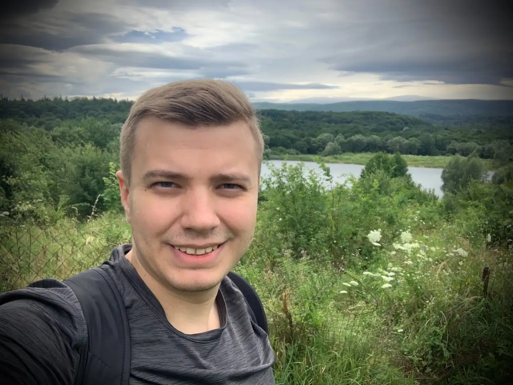

# Introduction

{{#include _author.md}}

I love walking. When I’m in an unfamiliar place, I try to explore it on foot. If
possible, I rent a bicycle. It lets me move faster and see more. If cycling does
not feel safe, I stick to walking.

In this section, I write about places I’ve visited and how they felt to me at the
time. Some places change between visits. Others do not. This blog is a record of
those moments, paired with photos taken along the way.

